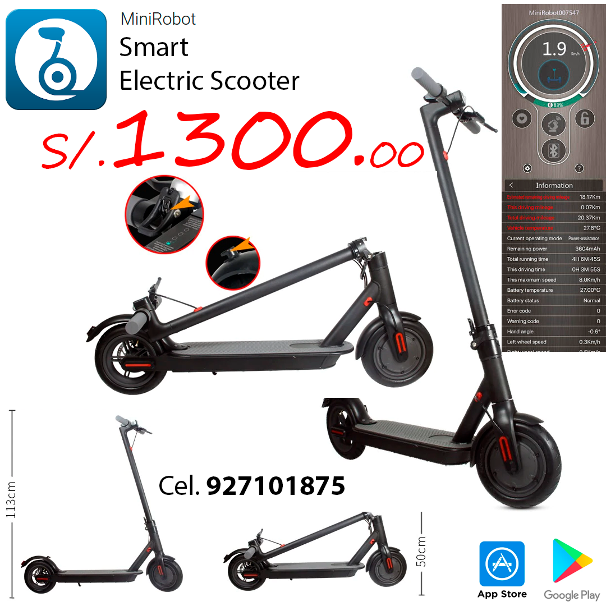

# Flyer-ElectricScooter
> This is an Electric Scooter, The MX PRO is the upgraded version of original MX1. The MX Pro's battery has been increased over the standard MX1, now offering a max range of 25miles. 360Wh 36V/10Ah Lithium Electric Scooter makes the last mile of your commute fast and fun .

## Built With

- GIMP 2.10

## Authors

👤 **Jasem Duncan Valencia Vargas**

- Github: [JasemDuncan](https://github.com/JasemDuncan)
- Linkedin: [Jasem-Duncan-Valencia](https://www.linkedin.com/in/jasem-duncan-valencia/)
- E-mail: [Jasem Valencia](jasemvalencia@gmail.com)

## 🤝 Contributing

Contributions, issues and feature requests are welcome!

Feel free to check the [issues page](issues/).

## Show your support

Give a ⭐️ if you like this project!

## Acknowledgments

- Hat tip to anyone whose code was used
- Inspiration
- etc

## 📝 License

This project is [MIT](lic.url) licensed.